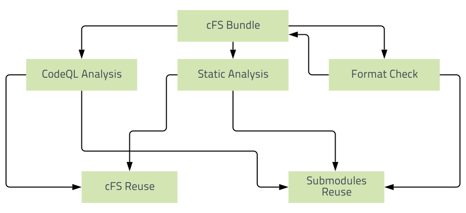

# Our Workflows

## Reusable Workflows

To reduce duplication, the workflows CodeQL Analysis, Static Analysis, and Format Checker are placed in cFS to be reused in the subrepositories. 

CodeQL Analysis and Static Analysis require inputs, therefore, they are called in an additional workflow in cFS to be utilized. Format checker does not need to be reused in cFS because it does not require inputs. 

Provided is a diagram of the architecture of the reusable workflows.

## Deprecated Build, Test, and Run

This action builds, tests, and runs the cFS bundle using deprecated code. The flag OMIT_DEPRECATED is set to false. For more information on the OMIT_DEPRECATED flag, see [global_build_options.cmake](https://github.com/nasa/cFE/blob/063b4d8a9c4a7e822af5f3e4017599159b985bb0/cmake/sample_defs/global_build_options.cmake). 

Build, Test, and Run runs for every push and every pull request on all branches of cFS in Github Actions.

## Build, Test, and Run [OMIT_DEPRECATED=true]

This action builds, tests, and runs the cFS bundle omitting deprecated code.

Build, Test, and Run [OMIT_DEPRECATED=true] runs for every push and every pull request on all branches of cFS in Github Actions. For more information on the OMIT_DEPRECATED flag, see [global_build_options.cmake](https://github.com/nasa/cFE/blob/063b4d8a9c4a7e822af5f3e4017599159b985bb0/cmake/sample_defs/global_build_options.cmake). 

## Build and Test in RTEMS [OMIT_DEPRECATED=true]
[![Build and Test rtems 4.11 [OMIT_DEPRECATED=true]](https://github.com/nasa/cFS/actions/workflows/build-cfs-rtems4.11.yml/badge.svg)](https://github.com/nasa/cFS/actions/workflows/build-cfs-rtems4.11.yml)
[![Build and Test rtems 5 [OMIT_DEPRECATED=true]](https://github.com/nasa/cFS/actions/workflows/build-cfs-rtems5.yml/badge.svg)](https://github.com/nasa/cFS/actions/workflows/build-cfs-rtems5.yml)

This action builds and tests the cFS bundle omitting deprecated code in both RTEMS 4.11 and RTEMS 5.

Build and Test in RTEMS 4.11 and 5 runs for every push and every pull request on all branches of cFS in Github Actions.

## CodeQL Analysis

This action runs GitHub's static analysis engine, CodeQL, against our repository's source code to find security vulnerabilities. It then automatically uploads the results to GitHub so they can be displayed in the repository's code scanning alerts found under the security tab. CodeQL runs an extensible set of [queries](https://github.com/github/codeql), which have been developed by the community and the [GitHub Security Lab](https://securitylab.github.com/) to find common vulnerabilities in your code.

CodeQL runs for every push and pull-request on all branches of cFS in GitHub Actions.

For the CodeQL GitHub Actions setup, visit https://github.com/github/codeql-action.

Our CodeQL action uses a configuration file to use specific queries, which can be found at [.github/codeql](https://github.com/nasa/cFS/tree/main/.github/codeql).

## Static Analysis

This action runs a static analysis tool for C/C++ code known as cppcheck. Cppcheck is designed to be able to analyze C/C++ code even if it has non-standard syntax, which is common in embedded projects.

The cFS Cppcheck GitHub Actions workflow and results are available to the public. To view the results, select a workflow and download the artifacts.

Cppcheck runs for every push on the main branch and every pull request on all branches of cFS in Github Actions.

For more information about Cppcheck, visit http://cppcheck.sourceforge.net/.

## Local Unit Test

This action tests our code using GCC's coverage testing tool gcov.

Local Unit Test runs for every push and every pull request on all branches of cFS in Github Actions.

## Documentation and Guides

This action creates doxygen documents for cFE, cFS users guide, and osal guide.

Documentation and Guides runs for every push and every pull request on all branches of cFS in Github Actions. The workflow pushes the PDFs for every push on the main branch. The PDFs can be found at https://github.com/nasa/cfs/tree/gh-pages. 

## Changelog

This action creates a changelog file which documents all the issues in cFS.

The Changelog action runs manually. 

## Format Check

This action uses [clang-format-10](https://github.com/nasa/cFS/blob/main/.clang-format) to check for format errors.
